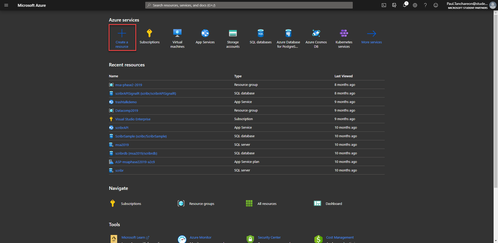

# phase1-msa2020

# Deploying Web App on Azure

## What is Azure?

Microsoft Azure is a cloud computing service that provides flexibility, security and reliability in managing IT infrastuctures. 

Azure enables an easy way to deploy web application through many different channels and platforms. Today we will deploy our web app directly from our GitHub repository and leverage simple CI/CD (continuous integration / continuous deployment) to speed up our development time.

## 1. Creating a new app service.

Head over to Azure and login with your registered student account.

Select `Create a resource`.

