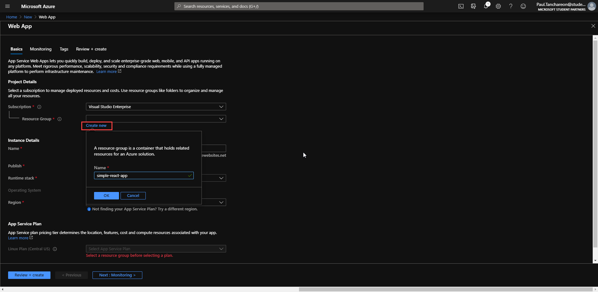
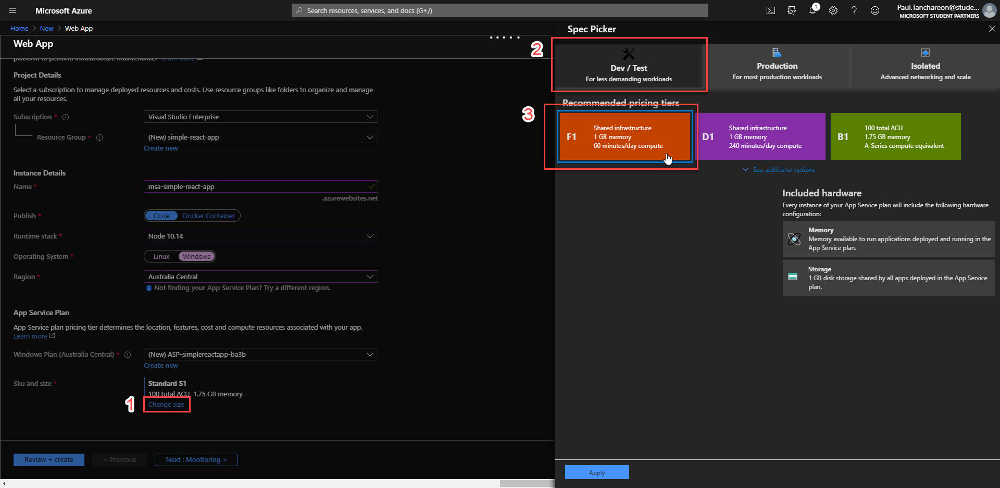
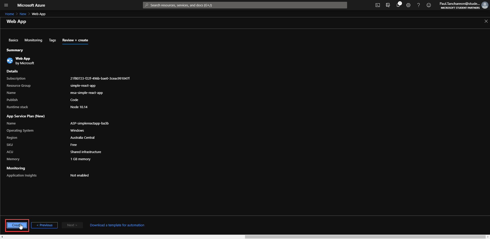
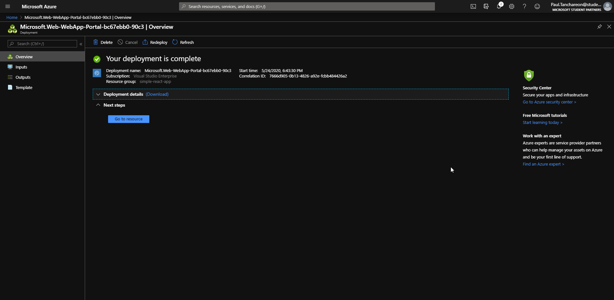
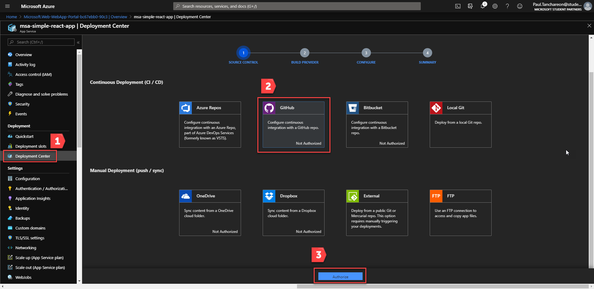
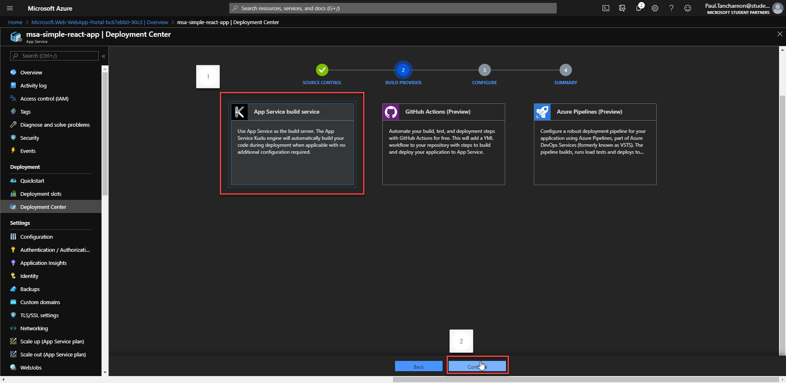
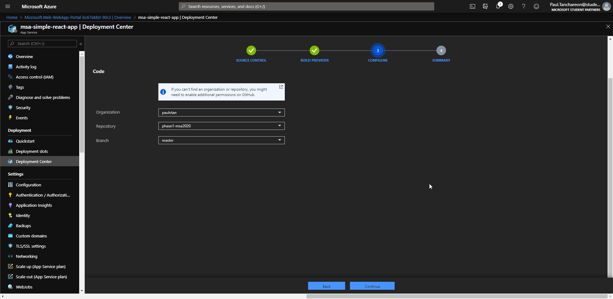

# phase1-msa2020

# Deploying Web App on Azure

## What is Azure?

Microsoft Azure is a cloud computing service that provides flexibility, security and reliability in managing IT infrastuctures. 

Azure enables an easy way to deploy web application through many different channels and platforms. Today we will deploy our web app directly from our GitHub repository and leverage simple CI/CD (continuous integration / continuous deployment) to speed up our development time.

## 1. Creating a new app service

Head over to Azure and login with your registered student account.

Select `Create a resource`.

## 2. Configure app service

**Project Details**

2.1 Select your available student subscription, it may have a different name.

2.2 Feel free to create a new resource group which helps group together permission, services belonging to this project.

**Instance Details**

2.3 `Name` : Your website name which will also be your url + `.azurewebsites.net`.

2.4 `Publish` : Select `Code`.

2.5 `Runtime stack` : For our react application, choose `Node 10.14`

2.6 `Operating System` : Choose `Linux`

2.7 `Region` : Choose any appropriate closest regions.

**App Service Plan**

2.8 `Sku and size` : Here we want to be careful as this can quickly deplete our credits. Select `Change size` to explore available options.

Often we are defaulted to Production tier, Azure makes it easy for developer to scale-up resource if needed. We will start with a free tier for now.

Select `Dev/Test` tab, choose `F1` and apply.

2.9 Review your app service details and create.

## 3. Configuring deployment center

3.1 Once your app service is created and ready. Head over to your resource.

3.2 Select `Deployment Center`, choose `GitHub` as your CI/CD source, then hit Authorize.

Note: You will be prompted to log in to GitHub.

3.3 Select `App Service build service` and continue.

3.3 Select your repository and branch you wish to deploy and hit continue.

## 4. Check your website.

It may take quite a while for Azure to build and deploy your code.

4.1 Navigate to `Overview` tab 